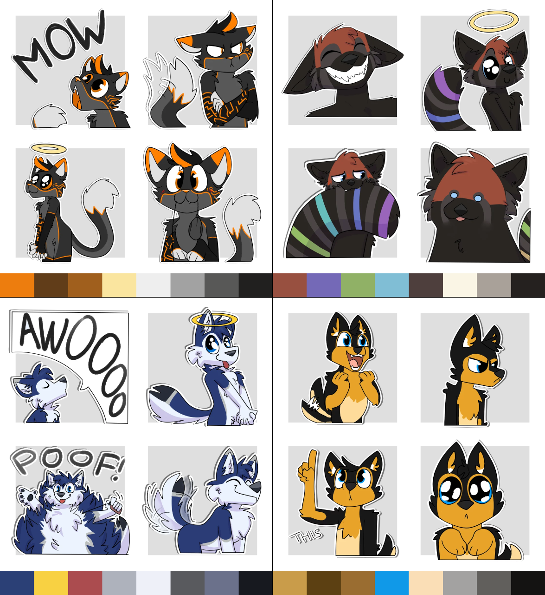

# StickerColorLibrary

**StickerColorLibrary** is designed to generate color palettes from a collection of stickers, such as Telegram or Discord stickers. Its strengths are detecting colors that occur repeatedly throughout an entire pack, and prioritizing colors that are higher in saturation and value.

It is intended for use by developers to make picking the "primary" color of sticker packs easy when working on sticker-related projects.

# Installation

Minimum Python version is 3.7.

Installation is straightforward. Clone this repo, install the requirements with `pip install -r requirements.txt`, then import the library. It is a single file with one class, so you can simply just:

```python
from colorlib import Colors
```

# Example

```python
colors = Colors(["01.png", "02.png", "03.png", "04.png"])

colors.filter_transparency(threshold=230)
    .run_kmeans(k_clusters=8, runs=64, max_iter=256)
    .filter_saturation(threshold=35)
    .filter_value(threshold=20)
    .rgb_colors  # Returns a filtered list of 8 RGB color values
```

The color bars under each sticker set were generated from that set using the above code, and are sorted in order from most to least relevance as determined by the filters.



**Artwork:** [@Vanillayote](https://twitter.com/Vanillayote)  
**Characters:** [@glitchfur](https://twitter.com/glitchfur), [@raspberrywah](https://twitter.com/raspberrywah), [@levithehusky](https://twitter.com/levithehusky), [@Frontrox](https://twitter.com/Frontrox)

_All artwork and characters used with permission._

# License

This project is licensed under [GNU GPLv3](/LICENSE.txt).

# Documentation

Full API documentation is available [here](https://docs.glitchfur.net/StickerColorLibrary/).
